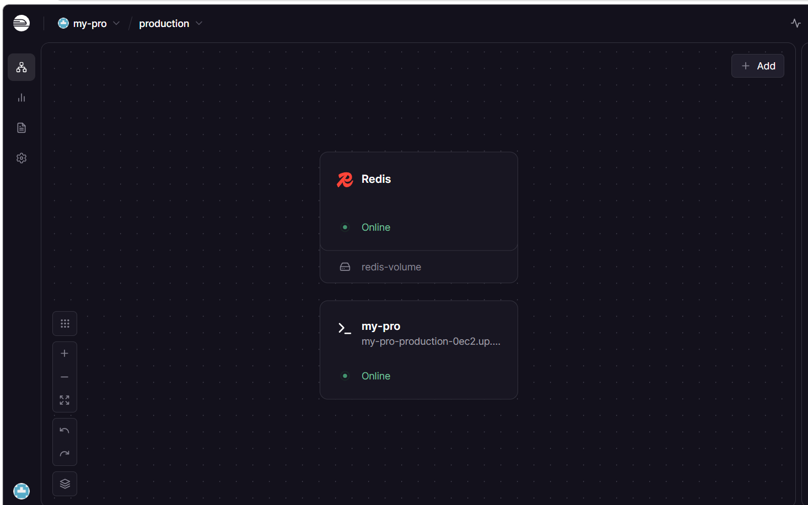
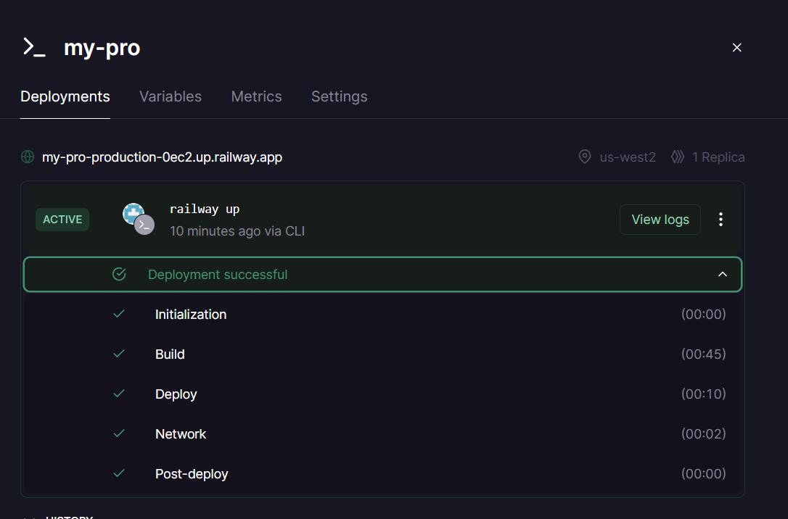

# Deployment Information

## Public URL
https://my-pro-production-0ec2.up.railway.app/

## Platform
Railway

## Test Commands

### Health Check
```bash
curl https://my-pro-production-0ec2.up.railway.app/health
(.venv) PS C:\Users\MSI\vinuni> curl https://my-pro-production-0ec2.up.railway.app/health


StatusCode        : 200
StatusDescription : 
Content           : {"status":"ok","version":"1.0.0","environment":"production","uptime_seconds":206.9,"total
                    _requests":3,"checks":{"llm":"mock","redis":true},"timestamp":"2026-04-17T15:13:05.626824
                    +00:00"}
RawContent        : HTTP/1.1 200 
                    Connection: keep-alive
                    x-railway-cdn-edge: fastly/cache-qpg1227-QPG
                    referrer-policy: strict-origin-when-cross-origin
                    x-content-type-options: nosniff
                    x-frame-options: DENY
                    x-railway...
Forms             : {}
Headers           : {[Connection, keep-alive], [x-railway-cdn-edge, fastly/cache-qpg1227-QPG], 
                    [referrer-policy, strict-origin-when-cross-origin], [x-content-type-options, nosniff]...} 
Images            : {}
InputFields       : {}
Links             : {}
ParsedHtml        : mshtml.HTMLDocumentClass
RawContentLength  : 186

```
### Ask check
With API key works:
```bash
(venv) kuongan@DESKTOP-NF3QU5J:/mnt/c/Users/MSI/vinuni/day12_ha-tang-cloud_va_deployment/my-production-agent$ 
curl -X POST https://my-pro-production-0ec2.up.railway.app/ask -H "X-API-Key: 73d8e332391aa58f2623fd4a228a8e47575c66868ef4fe99dbe78f2ef962c221"  -H "Content-Type: application/json"  -d '{"user_id": "test", "question": "Hello"}'
{"question":"Hello","answer":"Your request was processed successfully by the AI service.","model":"gpt-4o-mini","timestamp":"2026-04-17T15:17:35.805620+00:00"}
```

Without key:
```bash
(venv) kuongan@DESKTOP-NF3QU5J:/mnt/c/Users/MSI/vinuni/day12_ha-tang-cloud_va_deployment/my-production-agent$ 
curl -X POST https://my-pro-production-0ec2.up.railway.app/ask
{"detail":"Invalid or missing API key. Include header X-API-Key."}(venv) kuongan@DESKTOP-NF3QU5J:/mnt/c/Users/MSI/vinuni/day12_ha-tang-cloud_va_deployment/my-production-agent$  
```

### Test Rate limit
```bash
(venv) kuongan@DESKTOP-NF3QU5J:/mnt/c/Users/for i in {1..15}; do ang-cloud_va_deployment/my-production-agent$  
>   curl -X POST https://my-pro-production-0ec2.up.railway.app/ask -H "X-API-Key: 73d8e332391aa58f2623fd4a228a8e47575c66868ef4fe99dbe78f2ef962c221"  -H "Content-Type: application/json"  -d '{"user_id": "test", "question": "test"}';
> done
{"question":"test","answer":"Day 12 production agent is running correctly.","model":"gpt-4o-mini","timestamp":"2026-04-17T15:21:48.074880+00:00"}{"question":"test","answer":"This is a mock response. Replace with real LLM provider in production.","model":"gpt-4o-mini","timestamp":"2026-04-17T15:21:48.973388+00:00"}{"question":"test","answer":"Your request was processed successfully by the AI service.","model":"gpt-4o-mini","timestamp":"2026-04-17T15:21:49.825158+00:00"}{"question":"test","answer":"Day 12 production agent is running correctly.","model":"gpt-4o-mini","timestamp":"2026-04-17T15:21:50.639437+00:00"}{"question":"test","answer":"This is a mock response. Replace with real LLM provider in production.","model":"gpt-4o-mini","timestamp":"2026-04-17T15:21:51.532860+00:00"}{"question":"test","answer":"Your request was processed successfully by the AI service.","model":"gpt-4o-mini","timestamp":"2026-04-17T15:21:52.399795+00:00"}{"question":"test","answer":"This is a mock 
response. Replace with real LLM provider in production.","model":"gpt-4o-mini","timestamp":"2026-04-17T15:21:53.024293+00:00"}{"question":"test","answer":"This is a mock response. Replace with real LLM provider in production.","model":"gpt-4o-mini","timestamp":"2026-04-17T15:21:53.637478+00:00"}{"question":"test","answer":"This 
is a mock response. Replace with real LLM provider in production.","model":"gpt-4o-mini","timestamp":"2026-04-17T15:21:54.389107+00:00"}{"question":"test","answer":"This is a mock response. Replace with real LLM provider in production.","model":"gpt-4o-mini","timestamp":"2026-04-17T15:21:55.344406+00:00"}{"detail":"Rate limit exceeded: 10 req/min"}{"detail":"Rate limit exceeded: 10 req/min"}{"detail":"Rate limit exceeded: 10 req/min"}{"detail":"Rate limit exceeded: 10 req/min"}{"detail":"Rate limit exceeded: 10 req/min"}
```





