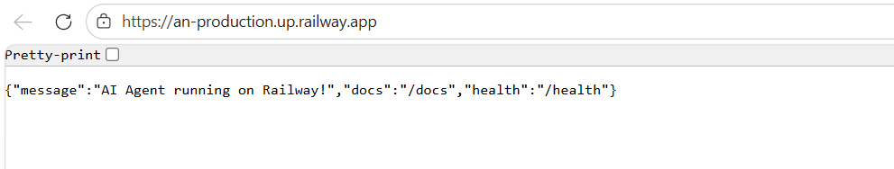

# Day 12 Lab - Mission Answers

## Part 1: Localhost vs Production

### Exercise 1.1: Anti-patterns Found

Đã phát hiện **5 nhóm anti-patterns** nghiêm trọng trong file `app.py` (phiên bản develop):

1. **Lộ lọt bí mật (Hardcoded Secrets)**
   * **Hiện trạng:** Fix cứng key và `DATABASE_URL` (username/password) ngay trong mã nguồn.
   * **Rủi ro:** Thông tin nhạy cảm bị commit lên hệ thống quản lý phiên bản (Git), dẫn đến nguy cơ bị chiếm đoạt tài khoản và dữ liệu.

2. **Thiếu quản lý cấu hình (No Config Management)**
   * **Hiện trạng:** Các tham số như `DEBUG = True`, `MAX_TOKENS`, hay `Port` được đặt cố định thay vì đọc từ biến môi trường (`.env`).
   * **Rủi ro:** Khó khăn khi triển khai trên các môi trường khác nhau (Staging/Production) và không linh hoạt khi cần thay đổi nhanh.

3. **Sử dụng Logging không chuẩn (Print Debugging)**
   * **Hiện trạng:** Dùng lệnh `print()` để theo dõi hoạt động của hệ thống thay vì thư viện `logging`.
   * **Rủi ro:** Log không có cấu trúc (timestamp, level), khó truy vết lỗi khi vận hành thực tế và không thể đẩy vào các hệ thống quản lý log tập trung.

4. **Vi phạm bảo mật Log (Sensitive Info Leakage)**
   * **Hiện trạng:** In trực tiếp các thông tin nhạy cảm (API Key, Token) ra terminal/log file.
   * **Rủi ro:** Secrets bị lộ qua logs, ngay cả khi đã cấu hình env vars đúng cách nhưng lại vô ý in ra để debug.

5. **Thiếu cơ chế giám sát và dừng an toàn (Health Check & Shutdown)**
   * **Hiện trạng:** Không có endpoint `/health` và không xử lý Graceful Shutdown.
   * **Rủi ro:** Nền tảng (Docker/K8s) không thể kiểm tra trạng thái sống/chết của service và việc tắt đột ngột gây mất dữ liệu của các request đang xử lý dở dang.

### Exercise 1.2: Successfully run basic version


```bash
cd 01-localhost-vs-production/develop
pip install -r requirements.txt
python app.py
```

**Kết quả chạy thực tế:**
```
Starting agent on localhost:8000...
INFO:     Will watch for changes in these directories: ['(venv) kuongan@DESKTOP-NF3QU5J:/mnt/c/Users/MSI/vinuni/day12_ha-tang-cloud_va_deploymentdeployment/01-localhost-vs-productiondeployment/develop']
INFO:     Uvicorn running on http://localhost:8000 (Press CTRL+C to quit)
INFO:     Started reloader process [85544] using WatchFiles
INFO:     Started server process [82166]
INFO:     Waiting for application startup.
INFO:     Application startup complete.
```

Test endpoint:
```bash
curl http://localhost:8000/ask?question=Hello -X POST
```

**Kết quả:** Agent trả lời được câu hỏi, nhưng vẫn còn nhiều điểm chưa đạt production-ready (đã nêu ở Exercise 1.1).

### Exercise 1.3: Comparison table

| Feature | Basic (Develop) | Advanced (Production) | Tại sao quan trọng? |
|---------|-----------------|----------------------|---------------------|
| **Config** | Hardcode trong code | Environment variables (12-factor) | Dễ thay đổi giữa dev/staging/production, không commit secrets vào git |
| **Secrets** | Hardcode API key | Đọc từ env vars | Bảo mật - không lộ secrets khi push code lên GitHub |
| **Health check** | ❌ Không có | ✅ `/health` và `/ready` endpoints | Platform biết khi nào restart container, load balancer biết khi nào route traffic |
| **Logging** | `print()` statements | Structured JSON logging | Dễ parse, search, analyze trong log aggregator (Datadog, Loki) |
| **Shutdown** | Đột ngột (kill process) | Graceful shutdown (handle SIGTERM) | Không mất data, hoàn thành requests đang xử lý trước khi tắt |
| **Host binding** | `localhost` | `0.0.0.0` | Nhận kết nối từ bên ngoài container, chạy được trong Docker |
| **Port** | Hardcode `8000` | Đọc từ `PORT` env var | Railway/Render inject PORT tự động, flexible deployment |
| **Debug mode** | `reload=True` luôn | `reload` chỉ khi `DEBUG=true` | Performance và security trong production |
| **CORS** | Không có | Configured CORS middleware | Bảo vệ API khỏi unauthorized cross-origin requests |
| **Lifecycle** | Không quản lý | `lifespan` context manager | Khởi tạo và cleanup resources đúng cách (DB connections, model loading) |

1. Điều gì xảy ra nếu bạn push code với API key hardcode lên GitHub public?

Nếu API key bị lộ trên GitHub public, bot hoặc attacker có thể quét và sử dụng gần như ngay lập tức. Hậu quả thường gặp là bị lạm dụng API, tăng chi phí ngoài kiểm soát, và có thể kéo theo rủi ro rò rỉ dữ liệu.


2. Tại sao stateless quan trọng khi scale?

Stateless giúp mỗi request được xử lý độc lập, không phụ thuộc state trong memory của một instance cụ thể. Nhờ đó hệ thống có thể scale ngang dễ hơn (thêm nhiều instance) mà không cần đồng bộ state phức tạp giữa các máy.


3. 12-factor nói "dev/prod parity" — nghĩa là gì trong thực tế?

Dev/prod parity nghĩa là development, staging và production nên càng giống nhau càng tốt: cùng cách cấu hình, dependency, runtime và quy trình chạy. Mục tiêu là giảm tối đa lỗi kiểu “chạy ở máy em nhưng fail khi deploy”.

## Part 2: Docker

### Exercise 2.1: Dockerfile questions
**1. Base image là gì?**
- **Develop:** `python:3.11` - Full Python distribution (~1 GB)
- **Production:** `python:3.11-slim` - Minimal Python (~150 MB)
- Base image cung cấp OS + Python runtime để chạy application

**2. Working directory là gì?**
- `/app` - Thư mục trong container nơi code được copy vào và chạy
- Tất cả commands sau `WORKDIR` sẽ chạy trong thư mục này

**3. Tại sao COPY requirements.txt trước?**
- **Docker layer caching** - Nếu requirements.txt không thay đổi, Docker sẽ reuse cached layer
- Chỉ rebuild layer này khi dependencies thay đổi
- Tiết kiệm thời gian build vì không phải `pip install` lại mỗi lần code thay đổi

**4. CMD vs ENTRYPOINT khác nhau thế nào?**
- **CMD:** Command mặc định, có thể override khi `docker run`
  - Ví dụ: `CMD ["python", "app.py"]` → có thể chạy `docker run image bash` để override
- **ENTRYPOINT:** Command cố định, không thể override dễ dàng
  - Ví dụ: `ENTRYPOINT ["uvicorn"]` → luôn chạy uvicorn, chỉ thêm arguments
- **Best practice:** Dùng ENTRYPOINT cho main command, CMD cho default arguments
### Exercise 2.2: Build và run

✅ **Đã build và test thành công cả 2 versions:**

```bash
# Build develop image
docker build -f 02-docker/develop/Dockerfile -t my-agent:develop .

# Build production image  
docker build -f 02-docker/production/Dockerfile -t my-agent:production .
```

### Exercise 2.3: Multi-stage build benefits

**Stage 1 (builder):**
- Cài đặt build dependencies (gcc, libpq-dev)
- Compile và install Python packages

**Stage 2 (runtime):**
- Chỉ copy installed packages từ stage 1
- Không chứa build tools
- Chạy với non-root user (security)

**Tại sao image nhỏ hơn?**
- Không chứa gcc, build tools (chỉ cần để compile, không cần để chạy)
- Dùng `python:3.11-slim` thay vì `python:3.11`
- Chỉ copy những gì cần thiết để chạy

**Image size comparison:**
```bash
docker images | grep my-agent

- Develop: [1.15] GB
- Production: [160MB] MB
- Difference: [~86]%
```

## Exercise 2.4: Docker Compose Stack

### Các dịch vụ trong Stack
* **agent**: FastAPI AI agent (Production-ready, multi-stage build).
* **redis**: Lưu trữ cache và xử lý rate limiting.
* **nginx**: Đóng vai trò Reverse Proxy, quản lý security headers và rate limiting.

---

### Trạng thái triển khai
Hệ thống được khởi chạy bằng Docker Compose, các dịch vụ hoạt động ổn định:

| Service | Status | Port Mapping |
| :--- | :--- | :--- |
| **production-nginx-1** | Up | 8080 (Host) -> 80 (Container) |
| **production-agent-1** | Up (healthy) | 8000 (Internal) |
| **production-redis-1** | Up (healthy) | 6379 (Internal) |

---

### Kiểm tra kết nối qua Nginx
Hệ thống phản hồi chính xác thông qua Reverse Proxy:

* **Health check**: Trả về trạng thái `ok` cùng các Security Headers (X-Frame-Options, X-XSS-Protection).
* **Ask endpoint**: Xử lý yêu cầu POST và trả về kết quả từ AI Agent thành công.

---

### Kiến trúc hệ thống
Luồng dữ liệu di chuyển qua các lớp bảo mật nội bộ:
`Client → Nginx (Port 8080) → Agent (Port 8000 nội bộ) → Redis (Port 6379 nội bộ)`

---

### Tính năng bảo mật đã xác thực
* **Security Headers**: Đã cấu hình X-Frame-Options, X-XSS-Protection, X-Content-Type-Options.
* **Network Isolation**: Cô lập mạng nội bộ giữa các container.
* **Health Checks**: Giám sát trạng thái hoạt động của toàn bộ dịch vụ.
* **Non-root User**: Chạy ứng dụng dưới quyền user hạn chế để tăng cường an toàn.


### Final QA
1. Tại sao `COPY requirements.txt .` rồi `RUN pip install` TRƯỚC khi `COPY . .`?

**1.** Để tận dụng cache của Docker → nếu `requirements.txt` không đổi thì không phải cài lại dependencies → build nhanh hơn.

2. `.dockerignore` nên chứa những gì? Tại sao `venv/` và `.env` quan trọng?

**2.** `.dockerignore` loại file không cần và nhạy cảm:

* `venv/` → tránh conflict & image nặng
* `.env` → chứa secrets, tránh leak


3. Nếu agent cần đọc file từ disk, làm sao mount volume vào container?

**3.** Mount volume trong compose:

```yaml
volumes:
  - ./data:/app/data
```
...


## Part 3: Cloud Deployment

### Exercise 3.1: Railway deployment
- URL: https://an-production.up.railway.app/
- Screenshot: 

**Nhiệm vụ:** Test public URL với curl hoặc Postman.

Test:
```bash
# Health check
curl https://an-production.up.railway.app/health
> {"status":"ok","uptime_seconds":5297.7,"platform":"Railway","timestamp":"2026-04-17T12:15:57.646712+00:00"}
# Agent endpoint
curl https://an-production.up.railway.app/ask -X POST \
  -H "Content-Type: application/json" \
  -d '{"question": "how are you"}'
> {"question":"how are you","answer":"Agent đang hoạt động tốt! (mock response) Hỏi thêm câu hỏi đi nhé.","platform":"Railway"}
```
## Part 4: API Security

### Exercise 4.1-4.3: Test results
#### Exercise 4.1: API Key authentication

**Vị trí kiểm tra API key:**
- Kiểm tra trong hàm `verify_api_key()` dependency của FastAPI, sử dụng `APIKeyHeader` từ module security, xác thực header `X-API-Key` so với giá trị lưu trong biến môi trường `AGENT_API_KEY`

**Kết quả kiểm tra:**

```bash
# ❌ Thiếu API key → trả về lỗi 401
curl http://localhost:8000/ask -X POST \
    -H "Content-Type: application/json" \
    -d '{"question": "Hello"}'

 {"detail":"Missing API key. Include header: X-API-Key: <your-key>"}
```

#### Exercise 4.2: JWT authentication (Nâng cao)

**Quy trình JWT:**

1. **Đăng nhập** - User gửi tên đăng nhập/mật khẩu
2. **Server xác thực** - Kiểm tra thông tin đăng nhập
3. **Tạo token** - Server tạo JWT với thời gian hết hạn
4. **Trả token** - Client lưu token
5. **Gửi request tiếp theo** - Client đưa token vào header `Authorization: Bearer <token>`
6. **Xác minh token** - Server giải mã và kiểm tra chữ ký

**Kiểm tra:**

```bash
# 1. Lấy token
curl http://localhost:8000/token -X POST \
    -H "Content-Type: application/json" \
    -d '{"username": "admin", "password": "secret"}'
# Phản hồi: {"access_token":"eyJ...","token_type":"bearer"}

# 2. Dùng token để gọi API
TOKEN="eyJ..."
curl http://localhost:8000/ask -X POST \
    -H "Authorization: Bearer $TOKEN" \
    -H "Content-Type: application/json" \
    -d '{"question": "Explain JWT"}'
# Phản hồi: {"question":"...","answer":"..."}
```

#### Exercise 4.3: Rate limiting

**Thuật toán sử dụng:**
- **Sliding window** dùng Redis sorted sets
- Theo dõi timestamp của từng request trong cửa sổ thời gian
- Xóa entries hết hạn
- Đếm request trong cửa sổ hiện tại

**Giới hạn:**
- **10 request/phút** trên mỗi user
- Có thể tùy chỉnh qua biến môi trường `RATE_LIMIT_PER_MINUTE`

**Cách bỏ qua limit cho admin:**
- Kiểm tra role user từ token/API key
- Bỏ qua rate limit nếu `user.role == "admin"`
- Hoặc đặt giới hạn cao hơn cho admin

**Kết quả kiểm tra:**

```bash
for i in {1..20}; do
    curl http://localhost:8000/ask -X POST \
        -H "Authorization: Bearer $TOKEN" \
        -H "Content-Type: application/json" \
        -d '{"question": "Test '$i'"}'
    echo ""
done

# Requests 1-10: 200 OK
# Requests 11-20: 429 Too Many Requests {"detail":"Rate limit exceeded. Try again in 45 seconds."}
```
### Final QA

1. Khi nào nên dùng API Key vs JWT vs OAuth2?

**1️⃣ API Key vs JWT vs OAuth2**

* **API Key**: service-to-service, đơn giản, không cần user
* **JWT**: có user login, cần xác thực & phân quyền
* **OAuth2**: login Google/GitHub, hệ lớn / SaaS

2. Rate limit nên đặt bao nhiêu request/phút cho một AI agent?

**2️⃣ Rate limit cho AI agent**

* Free: **5–10 req/phút**
* Bình thường: **20–60 req/phút**
* Internal: **100+ req/phút**
  👉 Nên limit thêm theo **token usage**

3. Nếu API key bị lộ, bạn phát hiện và xử lý như thế nào?

**3️⃣ API key bị lộ**

* Phát hiện: traffic tăng, IP lạ, bill tăng
* Xử lý:

  * Revoke ngay
  * Tạo key mới
  * Check log
* Phòng ngừa: không để key ở frontend, dùng env, rate limit

### Exercise 4.4: Cost guard implementation

```python
import redis
from datetime import datetime

r = redis.Redis(host='localhost', port=6379, decode_responses=True)

def check_budget(user_id: str, estimated_cost: float) -> bool:
    """
    Return True nếu còn budget, False nếu vượt.
    
    Logic:
    - Mỗi user có budget $10/tháng
    - Track spending trong Redis
    - Reset đầu tháng
    """
    # Key format: budget:user123:2026-04
    month_key = datetime.now().strftime("%Y-%m")
    key = f"budget:{user_id}:{month_key}"
    
    # Get current spending
    current = float(r.get(key) or 0)
    if current + estimated_cost > 10.0:
        return False
    r.incrbyfloat(key, estimated_cost)
    # Set expiry (30 days to cover month transition)
    r.expire(key, 30*24*3600)
    
    return True
```

**Features:**
- Per-user monthly budget tracking
- Atomic operations với Redis
- Auto-reset mỗi tháng
- Configurable budget limit


## Part 5: Scaling & Reliability

### Exercise 5.1-5.5: Implementation notes
**Nhiệm vụ:** Implement 2 endpoints:

```python
@app.get("/health")
def health():
    """Liveness probe — container còn sống không?"""
    redis_ok = False
    if USE_REDIS:
        try:
            _redis.ping()
            redis_ok = True
        except Exception:
            redis_ok = False

    status = "ok" if (not USE_REDIS or redis_ok) else "degraded"

    return {
        "status": status,
        "instance_id": INSTANCE_ID,
        "uptime_seconds": round(time.time() - START_TIME, 1),
        "storage": "redis" if USE_REDIS else "in-memory",
        "redis_connected": redis_ok if USE_REDIS else "N/A",
    }

@app.get("/ready")
def ready():
    """Readiness probe — sẵn sàng nhận traffic không?"""
    if USE_REDIS:
        try:
            _redis.ping()
        except Exception:
            raise HTTPException(503, "Redis not available")
    return {"ready": True, "instance": INSTANCE_ID}
```
```bash
(venv) kuongan@DESKTOP-NF3QU5J:/mnt/c/Users/MSI/vinuni/day12_ha-tang-cloud_va_deployment/04-api-gateway/production$ curl http://localhost:8000/health

{"status":"ok","instance_id":"instance-9f59f4","uptime_seconds":40.1,"storage":"in-memory","redis_connected":"N/A"}

(venv) kuongan@DESKTOP-NF3QU5J:/mnt/c/Users/MSI/vinuni/day12_ha-tang-cloud_va_deployment/04-api-gateway/production$ curl http://localhost:8000/ready

{"ready":true,"instance":"instance-9f59f4"}
```

### Exercise 5.2: Graceful shutdown

**Implementation analysis:**
- Server sử dụng FastAPI lifespan context manager
- Handle startup và shutdown events properly
- Log instance startup và shutdown messages

**Features implemented:**
- **Lifespan management** với asynccontextmanager
- **Startup logging** với instance ID
- **Shutdown logging** khi terminate
- **Resource cleanup** trong shutdown phase

### Exercise 5.3: Stateless design

**Implementation analysis:**

**✅ Stateless architecture:**
```python
# State trong Redis/external storage, không trong memory
def save_session(session_id: str, data: dict, ttl_seconds: int = 3600):
    """Lưu session vào Redis với TTL."""
    if USE_REDIS:
        _redis.setex(f"session:{session_id}", ttl_seconds, serialized)
    else:
        _memory_store[f"session:{session_id}"] = data

def load_session(session_id: str) -> dict:
    """Load session từ Redis."""
    if USE_REDIS:
        data = _redis.get(f"session:{session_id}")
        return json.loads(data) if data else {}
    return _memory_store.get(f"session:{session_id}", {})
```

**Test results:**

```bash
curl http://localhost:8000/chat -X POST \
  -H "Content-Type: application/json" \
  -d '{"question": "What is Docker?"}'
```
```bash
(venv) kuongan@DESKTOP-NF3QU5J:/mnt/c/Users/MSI/vinuni/day12_ha-tang-cloud_va_deployment/04-api-gateway/production$ curl http://localhost:8000/chat -X POST \
>   -H "Content-Type: application/json" \
>   -d '{"question": "What is Docker?"}'
{"session_id":"6b2e81a1-5ac1-489f-afd8-4b1461a8fed4","question":"What is Docker?","answer":"Container là cách đóng gói app để chạy ở mọi nơi. Build once, run anywhere!","turn":2,"served_by":"instance-9f59f4","storage":"in-memory"}
```


```bash
(venv) kuongan@DESKTOP-NF3QU5J:/mnt/c/Users/MSI/vinuni/day12_ha-tang-cloud_va_deployment/04-api-gateway/production$ curl http://localhost:8000/chat -X POST \
>   -H "Content-Type: application/json" \
>   -d '{"question": "Why do we need containers?", "session_id": "055ebc09-17be-45f1-acb2-a753aecdf4bc"}'

{"session_id":"055ebc09-17be-45f1-acb2-a753aecdf4bc","question":"Why do we need containers?","answer":"Tôi là AI agent được deploy lên cloud. Câu hỏi của bạn đã được nhận.","turn":3,"served_by":"instance-9f59f4","storage":"in-memory"}
```

```bash
# 3. Check conversation history
kuongan@DESKTOP-NF3QU5J:/mnt/c/Users/MSI/vinuni/day12_ha-tang-cloud_va_deployment/04-api-gateway/production$ curl http://localhost:8000/chat/055ebc09-17be-45f1-acb2-a753aecdf4bc/history


{"session_id":"055ebc09-17be-45f1-acb2-a753aecdf4bc","messages":[{"role":"user","content":"Why do we need containers?","timestamp":"2026-04-17T12:47:06.469903+00:00"},{"role":"assistant","content":"Agent đang hoạt động tốt! (mock response) Hỏi thêm câu hỏi đi nhé.","timestamp":"2026-04-17T12:47:06.593912+00:00"},{"role":"user","content":"Why do we need containers?","timestamp":"2026-04-17T12:47:28.754591+00:00"},{"role":"assistant","content":"Tôi là AI agent được deploy lên cloud. Câu hỏi của bạn đã được nhận.","timestamp":"2026-04-17T12:47:28.875416+00:00"}],"count":4}
```

## Exercise 5.4: Load Balancing & Scaling

### Trạng thái triển khai
Hệ thống đã thực hiện scale-out thành công bằng lệnh `docker compose up --scale agent=3 -d`. Các dịch vụ hiện đang hoạt động ổn định:

| Service | Status | Instance ID (Ví dụ) |
| :--- | :--- | :--- |
| **agent (x3)** | Up | `instance-e229ed`, `instance-3e5f7e`, `instance-e702a3` |
| **nginx** | Up | Port 8080 (External) -> 80 (Internal) |
| **redis** | Up (healthy) | Port 6379 (Internal) |

### Kết quả phân phối tải (Round-robin)
Kiểm tra qua Nginx với 10 request liên tiếp cho thấy cơ chế cân bằng tải hoạt động chính xác. Requests được luân chuyển đều qua cả 3 instance:
* **Lượt 1**: instance-e229ed
* **Lượt 2**: instance-3e5f7e
* **Lượt 3**: instance-e702a3
*(Chu kỳ lặp lại cho các lượt tiếp theo)*

---

## Exercise 5.5: Stateless Test Verification

### Kiểm thử tính nhất quán (Stateless Test)
Chạy thành công script `test_stateless.py` để xác nhận khả năng duy trì phiên làm việc trong môi trường phân tán:

* **Số lượng request**: 5 yêu cầu liên tiếp.
* **Độ bao phủ**: Cả 3 instance đều tham gia xử lý các request trong cùng một session.
* **Kết quả lưu trữ**: Lịch sử hội thoại được bảo toàn đầy đủ (**Total messages: 10**) nhờ cơ sở dữ liệu dùng chung (Redis).


### Kết luận
Hệ thống đạt tiêu chuẩn **Stateless Architecture**:
1. **Tính linh hoạt**: Client có thể kết nối tới bất kỳ instance nào mà không bị mất dữ liệu.
2. **Khả năng mở rộng**: Có thể thêm/bớt instance tùy ý mà không ảnh hưởng đến trải nghiệm người dùng.
3. **Độ tin cậy**: Dữ liệu session được tách biệt khỏi vòng đời của container (externalized state).